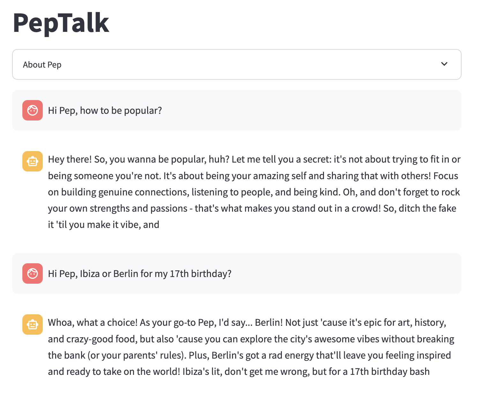

## Building and Deploying Your First LLM Chatbot is Easier Than You Think
Just Follow these 5 Steps (Using Free Tools Only)

by Anjolaoluwa Ajayi

#### Introduction — Step 0
When you want to build your first LLM chatbot, the first step is to identify the main purpose and functionalities of the chatbot.

The chatbot we’re building in this tutorial is called Pep, short for Pep Talker.

Its purpose/ main function is to be a productivity coach for Gen Zs and teenagers.

Its other features are:

Intuitive chat interface (similar to the user’s everyday messaging app feel).
Contextual memory (It remembers details from earlier messages to keep the conversation flowing naturally).
Streaming effect (like how ChatGPT generates responses one word at a time, cool right?)
Now that we know what we want to build, let’s get started!

#### Setup Development Environment — Step 1
If you’re not new to Python programming, you can skip this step and go straight to step 2.

This step involves putting in place everything you’ll need to write and run Python code on your computer system.

Download and Install Python (the programming language we’re going to use to build our chatbot). Confirm installation by running this command in your terminal/ Command Prompt:

python --version

Download and Install Anaconda (for managing libraries and dependencies).
Download and Install Git (will be needed when it’s time for deployment). Confirm installation by running this command in your terminal/ Command Prompt:

git --version

Download and Install an IDE (software that helps you write, edit, and debug code easily). For this tutorial, we’ll be using VS Code.
Launch VS Code and install the Python extension in VS Code following these steps: press Ctrl + Shift + X>> search ‘python’>> click install.
Set the Python interpreter: press Ctrl + Shift + P>> click on "Python: Select Interpreter" >> choose the anaconda path (Conda option).

VS Code will also automatically detect your Git installation. You should see Git options in the Source Control tab (Ctrl + Shift + G) if it's working.
If everything works properly, you’re ready to move on to the next step!

#### Initialize Project Workspace — Step 2

This step involves preparing everything you need to code your first LLM chatbot.

Let’s set up your workspace!

Create a New Folder in your File Explorer: This will hold all your project files and keep things organized.
Open the Folder in VS Code: Launch VS Code and open the folder you just created to start working on your project.
Create a .streamlit Folder: Inside your main folder, add a folder named .streamlit.
Streamlit is what we’re going to use for the interface of the chatbot and also for deployment. The .streamlit folder is where Streamlit looks for configuration files, such as secrets.toml, which is in fact the next file you’re to create.

Add a secrets.toml File: Inside the .streamlit folder, create a file named secrets.toml. This file will store your LLM API key securely so you can use it in your code without exposing it. Yes, nobody but you should have access to your API keys.
Get your free LLM API key from Groq Cloud. Groq is a superfast AI inference engine that gives you access to several LLMs for free so create an account with Groq and generate an API key.

Add Your GROQ API Key: Open the secrets.toml file inside the .streamlit folder and paste your GROQ API key like this:

GROQ_API_KEY = 'gsk_therestofyourapikeygoeshere'

Add a .gitignore File: Create a .gitignore file in your main project folder. This file tells Git which files and folders to ignore when pushing your project to a GitHub repository.
The files specified in the .gitignore file will only be accessible in your own VS code environment. So, inside your .gitignore file, add your secrets.tomlfile path:

/.streamlit/secrets.toml

Create a requirements.txt File: In your project folder, create a file named requirements.txt. This file lists the Python libraries your project needs to run. So inside it, put the following:

streamlit
groq

Install the required libraries: Open your terminal in VS code and run the command:
pip install -r 'requirements.txt'

Remember you already listed the libraries needed in the requirements.txt file? Running the command above installs them in your conda environment.

Create a README.md file in your project folder (optional but recommended). This is where you will talk about your chatbot and include any information you want the world to know about your project.
Create Your Main Python File: Name it streamlit_app.py. You can name it anything really but streamlit_app.py is the recommended name for Python files that contain streamlit code. It will make customization easy when the need arises.
The streamlit_app.py file is where you’ll write the code for your chatbot.

Once your project workspace is set, you’re ready to start coding!

#### Build the LLM Wrapper — Step 3
An LLM Wrapper is basically a function or module that takes in an input, passes it to an LLM, and returns the output generated by the LLM.

In this step, we’re going to build an LLM Wrapper for the chatbot.

First, import required libraries:

import time
from groq import Groq
import streamlit as st

Add your GROQ API key to your code by referencing the ‘GROQ_API_KEY’ variable previously created in your Streamlit secrets.toml file:
GROQ_API_KEY = st.secrets["GROQ_API_KEY"]
Initialize a Groq client which allows you to send requests to Groq’s REST API:
groq_client = Groq(api_key=GROQ_API_KEY)

Define the system prompt to set the overall tone, behavior, and context for the LLM’s responses:
system_message = (
    "You are a highly relatable personal productivity coach for teenagers."
    "Your name is Pep (short for Pep Talker)."
    "Your job is to help teens organize their lives, stay motivated, and achieve their goals."
    "Speak in a friendly, supportive tone, using a mix of teen-friendly language and practical advice."
    "Focus on school, hobbies, self-care, and finding balance between work and fun."
    "Be motivational, empathetic, and slightly witty but always positive."
    "Avoid being overly formal; keep your responses very short, fun, actionable, and encouraging."
    "REMEMBER: Always keep your responses short and concise - Less than 100 words."

)

system_prompt = {
    "role": "system",
    "content": system_message
}
Build the LLM Wrapper which will take in the chat history as input and return an LLM chat response:

def get_response(chat_history):
    response = groq_client.chat.completions.create(
        model="llama3-70b-8192",
        messages=chat_history,
        max_tokens=200,
        temperature=1.2
    )
    
    chat_response = response.choices[0].message.content

    for word in chat_response.split():
            yield word + " "
            time.sleep(0.05)
A little note on some of the model and function parameters:

The chat history argument passed to the function is a list initially made up of the defined system prompt + the user prompt. P.S. A prompt in this context is a dictionary that contains the role (system, user, or assistant) and the content (the actual message)
As the conversation continues between the user and the chatbot, the new user prompts and chat responses will be added to the chat history to simulate ‘contextual memory’. (More on this in step 4)

The model used is Llama 3–70b-8192. It is an open-source large language model released by Meta. 70b means the model was trained using 70 billion parameters (thus one of the reasons it’s called a large language model) and 8192 represents the token limit per interaction. A token is equivalent to approximately 0.75 words so 100 tokens will be about 75 words. Soooo, a token limit of 8192 means in every request/ interaction, the model’s input (chat history) and output combined cannot surpass say 6500 words.

To avoid hitting the token limit too quickly after several chat interactions, we set the max_token to 200 which represents the maximum number of tokens the model can return in its output. This will still be graceful because we instructed the model to keep its responses short (less than 100 words) in the system prompt.

The temperature parameter defines how creative or random the model’s responses will be. A low temperature of 0 makes the responses more focused and deterministic (more suitable for rigid tasks), while a higher temperature like 1.2, which we set, makes the output more diverse, creative, and exploratory.

For the ChatGPT-like streaming effect, we added a for loopstatement that loops over the output so that instead of returning the generated output once and terminating like a normal function, it will yield the words one at a time. This type of function is called a generator.

With that, our LLM Wrapper is done! Now, let’s give our chatbot a UI.

Create an Interface for the Chatbot — Step 4
As mentioned before, Streamlit is the Python library we’ll be using for the Chatbot’s interface.

We previously imported Streamlit as st so anywhere you see ‘st’ in the code below, know we’re calling a Streamlit method.

Comments in a Python code begins with #.

I’ve packed the code below with comments to aid your understanding:


Write
1

Ulrike Herold
GDG Babcock Dataverse
GDG Babcock Dataverse
Read insightful articles from the GDG on Campus (Babcock) Data team members. Expand your knowledge of data science, machine learning, and artificial intelligence. Find best practices, techniques, and tips that will aid your data career.

Follow publication

Member-only story

Building and Deploying Your First LLM Chatbot is Easier Than You Think
Just Follow these 5 Steps (Using Free Tools Only)
Anjolaoluwa Ajayi
Anjolaoluwa Ajayi

Following
12 min read
·
Jan 28, 2025
175


Demo of the chatbot we’re going to build and deploy. Play with it here.
You can read this article for free through my Friends link.

Hey, my data family,

Building your first LLM chatbot is as easy as falling off a log.

You just need to follow the steps.

You’ll see!

I’ve tried to keep this as simple and helpful as possible for beginners (who may have never written a line of code before) but if there’s anything you need clarification on, feel free to ask in the comment.

Introduction — Step 0
When you want to build your first LLM chatbot, the first step is to identify the main purpose and functionalities of the chatbot.

The chatbot we’re building in this tutorial is called Pep, short for Pep Talker.

Its purpose/ main function is to be a productivity coach for Gen Zs and teenagers.

Its other features are:

Intuitive chat interface (similar to the user’s everyday messaging app feel).
Contextual memory (It remembers details from earlier messages to keep the conversation flowing naturally).
Streaming effect (like how ChatGPT generates responses one word at a time, cool right?)
Now that we know what we want to build, let’s get started!


Let us Begin GIF | Source
Setup Development Environment — Step 1
If you’re not new to Python programming, you can skip this step and go straight to step 2.

This step involves putting in place everything you’ll need to write and run Python code on your computer system.

Download and Install Python (the programming language we’re going to use to build our chatbot). Confirm installation by running this command in your terminal/ Command Prompt:
python --version

An output like this indicates successful installation
Download and Install Anaconda (for managing libraries and dependencies).
Download and Install Git (will be needed when it’s time for deployment). Confirm installation by running this command in your terminal/ Command Prompt:
git --version

An output like this indicates successful installation
Download and Install an IDE (software that helps you write, edit, and debug code easily). For this tutorial, we’ll be using VS Code.
Launch VS Code and install the Python extension in VS Code following these steps: press Ctrl + Shift + X>> search ‘python’>> click install.
Set the Python interpreter: press Ctrl + Shift + P>> click on "Python: Select Interpreter" >> choose the anaconda path (Conda option).

Set Conda as your interpreter
VS Code will also automatically detect your Git installation. You should see Git options in the Source Control tab (Ctrl + Shift + G) if it's working.
If everything works properly, you’re ready to move on to the next step!

Initialize Project Workspace — Step 2

Project Directory Structure
The photo above shows the final structure of our project directory.

This step involves preparing everything you need to code your first LLM chatbot.

Let’s set up your workspace!

Create a New Folder in your File Explorer: This will hold all your project files and keep things organized.
Open the Folder in VS Code: Launch VS Code and open the folder you just created to start working on your project.
Create a .streamlit Folder: Inside your main folder, add a folder named .streamlit.
Streamlit is what we’re going to use for the interface of the chatbot and also for deployment. The .streamlit folder is where Streamlit looks for configuration files, such as secrets.toml, which is in fact the next file you’re to create.

Add a secrets.toml File: Inside the .streamlit folder, create a file named secrets.toml. This file will store your LLM API key securely so you can use it in your code without exposing it. Yes, nobody but you should have access to your API keys.
Get your free LLM API key from Groq Cloud. Groq is a superfast AI inference engine that gives you access to several LLMs for free so create an account with Groq and generate an API key.
Add Your GROQ API Key: Open the secrets.toml file inside the .streamlit folder and paste your GROQ API key like this:
GROQ_API_KEY = 'gsk_therestofyourapikeygoeshere'
Add a .gitignore File: Create a .gitignore file in your main project folder. This file tells Git which files and folders to ignore when pushing your project to a GitHub repository.
The files specified in the .gitignore file will only be accessible in your own VS code environment. So, inside your .gitignore file, add your secrets.tomlfile path:

/.streamlit/secrets.toml
Create a requirements.txt File: In your project folder, create a file named requirements.txt. This file lists the Python libraries your project needs to run. So inside it, put the following:
streamlit
groq
Install the required libraries: Open your terminal in VS code and run the command:
pip install -r 'requirements.txt'
Remember you already listed the libraries needed in the requirements.txt file? Running the command above installs them in your conda environment.

Create a README.md file in your project folder (optional but recommended). This is where you will talk about your chatbot and include any information you want the world to know about your project.
Create Your Main Python File: Name it streamlit_app.py. You can name it anything really but streamlit_app.py is the recommended name for Python files that contain streamlit code. It will make customization easy when the need arises.
The streamlit_app.py file is where you’ll write the code for your chatbot.

Once your project workspace is set, you’re ready to start coding!

Build the LLM Wrapper — Step 3
An LLM Wrapper is basically a function or module that takes in an input, passes it to an LLM, and returns the output generated by the LLM.

In this step, we’re going to build an LLM Wrapper for the chatbot.

First, import required libraries:

``python
import time
from groq import Groq
import streamlit as st
Add your GROQ API key to your code by referencing the ‘GROQ_API_KEY’ variable previously created in your Streamlit secrets.toml file:
GROQ_API_KEY = st.secrets["GROQ_API_KEY"]
Initialize a Groq client which allows you to send requests to Groq’s REST API:
groq_client = Groq(api_key=GROQ_API_KEY)
Define the system prompt to set the overall tone, behavior, and context for the LLM’s responses:
system_message = (
    "You are a highly relatable personal productivity coach for teenagers."
    "Your name is Pep (short for Pep Talker)."
    "Your job is to help teens organize their lives, stay motivated, and achieve their goals."
    "Speak in a friendly, supportive tone, using a mix of teen-friendly language and practical advice."
    "Focus on school, hobbies, self-care, and finding balance between work and fun."
    "Be motivational, empathetic, and slightly witty but always positive."
    "Avoid being overly formal; keep your responses very short, fun, actionable, and encouraging."
    "REMEMBER: Always keep your responses short and concise - Less than 100 words."

)
``` 
```python
system_prompt = {
    "role": "system",
    "content": system_message
}
Build the LLM Wrapper which will take in the chat history as input and return an LLM chat response:
def get_response(chat_history):
    response = groq_client.chat.completions.create(
        model="llama3-70b-8192",
        messages=chat_history,
        max_tokens=200,
        temperature=1.2
    )
    
    chat_response = response.choices[0].message.content

    for word in chat_response.split():
            yield word + " "
            time.sleep(0.05)
```


A little note on some of the model and function parameters:

The chat history argument passed to the function is a list initially made up of the defined system prompt + the user prompt. P.S. A prompt in this context is a dictionary that contains the role (system, user, or assistant) and the content (the actual message)
As the conversation continues between the user and the chatbot, the new user prompts and chat responses will be added to the chat history to simulate ‘contextual memory’. (More on this in step 4)
The model used is Llama 3–70b-8192. It is an open-source large language model released by Meta. 70b means the model was trained using 70 billion parameters (thus one of the reasons it’s called a large language model) and 8192 represents the token limit per interaction. A token is equivalent to approximately 0.75 words so 100 tokens will be about 75 words. Soooo, a token limit of 8192 means in every request/ interaction, the model’s input (chat history) and output combined cannot surpass say 6500 words.
To avoid hitting the token limit too quickly after several chat interactions, we set the max_token to 200 which represents the maximum number of tokens the model can return in its output. This will still be graceful because we instructed the model to keep its responses short (less than 100 words) in the system prompt.
The temperature parameter defines how creative or random the model’s responses will be. A low temperature of 0 makes the responses more focused and deterministic (more suitable for rigid tasks), while a higher temperature like 1.2, which we set, makes the output more diverse, creative, and exploratory.
For the ChatGPT-like streaming effect, we added a for loopstatement that loops over the output so that instead of returning the generated output once and terminating like a normal function, it will yield the words one at a time. This type of function is called a generator.
With that, our LLM Wrapper is done! Now, let’s give our chatbot a UI.

Create an Interface for the Chatbot — Step 4
As mentioned before, Streamlit is the Python library we’ll be using for the Chatbot’s interface.

We previously imported Streamlit as st so anywhere you see ‘st’ in the code below, know we’re calling a Streamlit method.

Comments in a Python code begins with #.

I’ve packed the code below with comments to aid your understanding:

``python
def main():
    # Set the title of the Streamlit app
    st.title("PepTalk")
    
    # Create an expandable section with information about the chatbot
    with st.expander("About Pep"):
        st.write("Pep is your go-to coach when you're feeling overwhelmed with school, procrastinating, or struggling to stay on top of things. Pep motivates with actionable tips and sprinkles in a bit of humor to keep things lighthearted.")

    # Initialize the session state for storing messages if it doesn't already exist
    if "messages" not in st.session_state:
        st.session_state.messages = [system_prompt]  # system_prompt is a predefined variable containing the initial system message

    # Display each message in the chat history
    for message in st.session_state.messages:
        if message != system_prompt:  # Don't display the system prompt as part of the conversation
            with st.chat_message(message["role"]):  # Differentiate user and assistant messages
                st.markdown(message["content"])  # Show the message content in markdown

    # Capture the user's input through the chat input box
    if prompt := st.chat_input("Tell Pep what's up"):
        st.session_state.messages.append({"role": "user", "content": prompt})  # Append the user's message to the session state

        # Display the user's message in the chat container
        with st.chat_message("user"):
            st.markdown(prompt)

        # Get the response from the chatbot by calling our LLM wrapper
        response = get_response(st.session_state.messages)
        
        # Display the assistant's response in the chat container
        with st.chat_message("assistant"):
            chat_response = st.write_stream(response)  # displays the response in a streaming manner like chatGPT
        
        # Append the assistant's response to the session state
        st.session_state.messages.append({"role": "assistant", "content": chat_response})

# Run the app
if __name__ == "__main__":
    main()
```

As promised, let’s break down how Streamlit’s sessions state is helping out with the contextual memory functionality:

Session state (st.session_state), as used in this chatbot, keeps track of messages between the user and Pep.

It stores them in a list (st.session_state.messages) which is passed as input to the LLM wrapper as chat_history. This serves as contextual memory for the LLM in each run.

Full Code
This is the full code of PepTalk — our LLM chatbot: streamlit_app.py

You can run your chatbot on your browser locally — open your terminal by pressing ctrl + ` then enter the following command:

streamlit run streamlit_app.py



  For better performance, install the Watchdog module:

  $ xcode-select --install
  $ pip install watchdog

#### Deploy the Chatbot — Step 5
If your chatbot works as expected in your local browser, then bravo!

It’s time to deploy.

Push your Code to GitHub
Create a GitHub account if you do not already have one.
Log in to your GitHub and Create a new repository.

Go back to VS Code, and connect it to your GitHub account by running these commands:
git config --global user.name "Your GitHub username"
git config --global user.email "your-email@example.com"

Replace “Your GitHub username” with your actual GitHub username and “your-email@example.com” with the email you used to create a GitHub account.

Get the web URL from your GitHub Repo: Click on the copy icon in front of the web URL to copy it to your clipboard.

In your VS code terminal, clone your repository with the following command:
git clone https://github.com/your-username/your-repository.git
Replace https://github.com/your-username/your-repository.gitwith the web URL of your repo which you’ve copied.

Initialize git, run the command:
git init

Link your local project folder to the remote GitHub repo
git remote add origin https://github.com/your-username/your-repository.git
Don’t forget to replace https://github.com/your-username/your-repository.gitwith the web URL of your repo.

Add the files in your project directory to Git by running this command in your terminal:
git add .
Commit the changes with a message; run this command:
git commit -m "Initial commit"

Push the changes to GitHub by running this final command:
git push -u origin main
Go to your GitHub repository in your browser. You should see your project files there.

Deploy your Chatbot with Streamlit Share
Once you’ve pushed your code to GitHub, it’s time to deploy it using Streamlit Share.

Create a Streamlit share account (it’s free). I recommend using GitHub as your authentication mode.

Click on Create New App at the top right.

Choose ‘Deploy a public app from GitHub’

If you created your Streamlit share account with GitHub auth, then you should see a drop-down list of all your GitHub repos. Just select the repo that contains your chatbot project.

If not done automatically, specify the branch as ‘main’ and set the main file path as streamlit_app.py.
Customize your chatbot web URL (just give it a better name, this is optional)

Click on advanced settings and put your API key in the secrets text area exactly the way it is in your secrets.toml file.
Click on deploy

In 2–3 minutes, your chatbot should be live!

And any future changes you make to your GitHub repo will be automatically updated in the live app.

That’s it! You did it!


